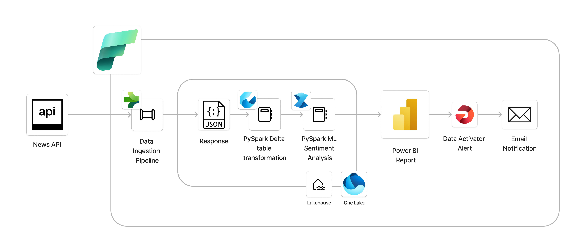
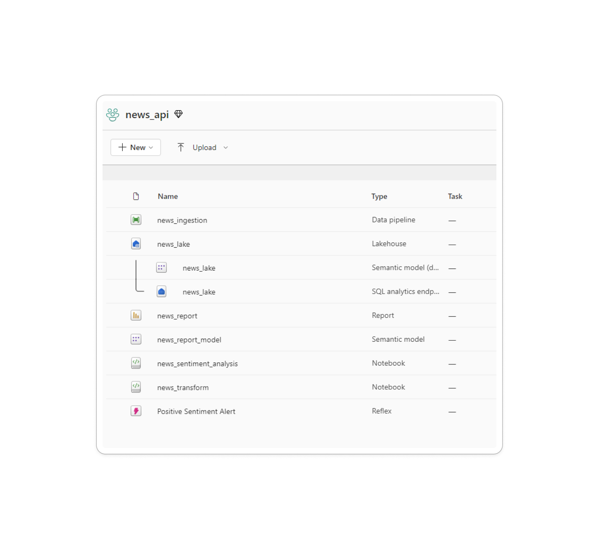
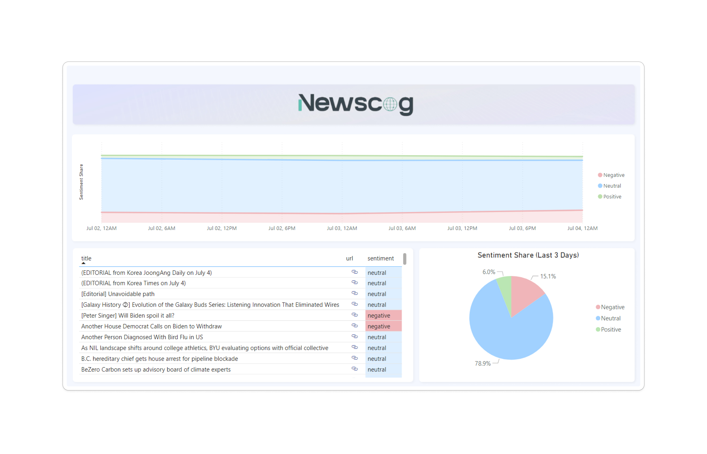

## Project Details

The goal was to create an end-to-end data engineering, analysis, visualization and ML project in Microsoft Fabric.
The steps include connection to a news API, transformation of the data and sentiment analysis and the visualizing them in Power BI.

The main goal is to create simple solutions/examples to demonstrate capabilities of those solutions without going too much in-depth in any of the steps.

** The .pbix file is not included since the data model and the report were created within the workspace using Fabric**

## Project Architecture

## Sources/Connections

#### Web APIs:
* Source: News API by https://www.thenewsapi.com/

#### Microsoft Fabric Pipeline:
1. "Copy Data" activitiy to connect to API and get JSON reposnse and save it in the Lakehouse
2. Use of PySpark notebooks to transform the JSON response to a delta table in the Lakehouse
3. Use of PySpark notebook with pre-trained Synapse ML model for sentiment analysis on news description and save to a new delta table in the lakehouse
4. Creation of a semantic model from the final table along with required measures to create a simple Power BI report with URLs for the sources
5. Use of Data Activator alerts to send email when a certain threshold of positive sentiment share is met

#### Power BI Report:

Notes:
- Use of Figma UI templates to create the canvas for the Power BI report
- Use SQL Merge Type 1 to avoid appending/duplicates/overwrites
